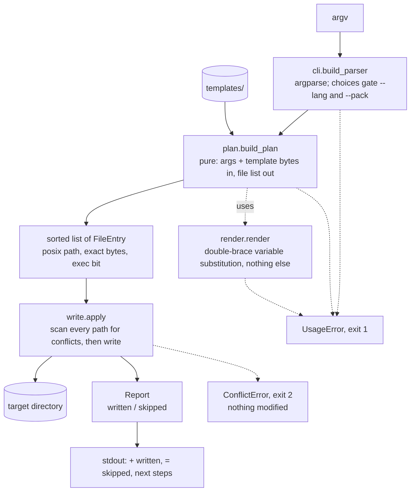
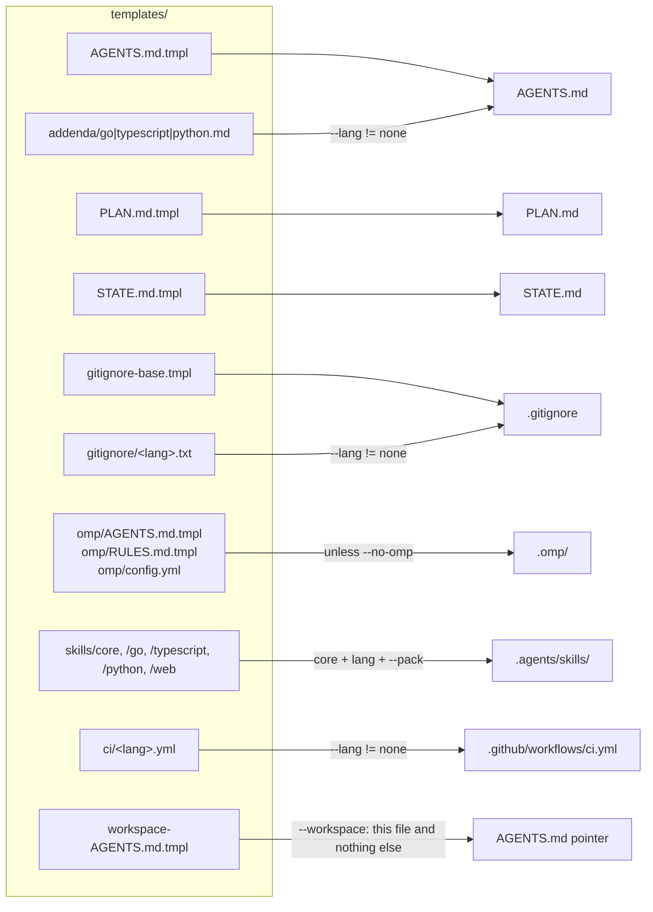
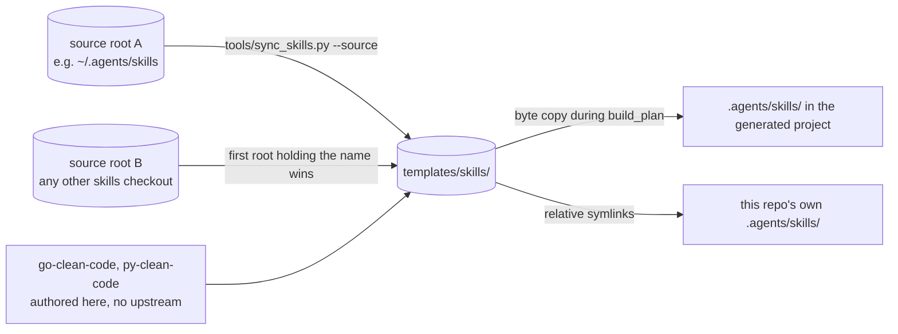
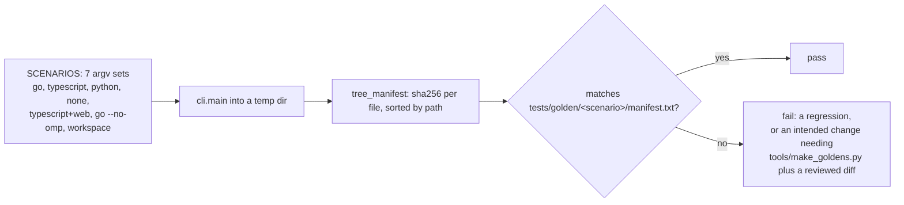

# agent-bootstrap

One command installs the standard agent operating system into any project: the `AGENTS.md` operating manual, portable skills, omp context, `STATE.md`, `PLAN.md`, a language addendum, and CI. After it runs, any agent that follows the `AGENTS.md` convention (Codex, Cursor, Jules, Gemini CLI, Amp, omp) picks up the same files, the same workflow, and the same rules, whichever directory of the repo it starts in.

## Philosophy

- Interoperability. Generated files follow open conventions only: `AGENTS.md` at the repo root, skills under `.agents/skills/<name>/SKILL.md`. Nothing requires a specific vendor. The `.omp/` directory is additive; other agents ignore it safely.
- Predictability. The generator is a pure function of its arguments and its template files. Same inputs give byte-identical output, proven by golden manifests in CI. It never reads the clock, the user, the hostname, or the network, and it never writes a file it did not announce.
- Determinism by default. Generated projects carry hard rules against non-deterministic agent and code behavior: injected clocks and randomness, no ambient environment or locale reads in logic, frozen lockfiles, fake timers in tests, UTC everywhere, JSON-only logging. The language addendum instantiates each rule per ecosystem.
- Planning before implementation. Generated repos keep `PLAN.md` as an append-only decision log, newest dated entry first, and their manual makes planning the default first step for non-trivial requests.

## How it fits together

One pass, no loops back. `bootstrap.py` puts the repo on `sys.path` and hands `argv` to `cli.main`. The CLI parses arguments, `plan.build_plan` turns those arguments plus template bytes into a sorted list of `FileEntry` records, and `write.apply` is the only code in the project that touches the target directory. `build_plan` does no I/O on the target at all, so a dry run and a real run compute the identical plan.



The conflict scan is what makes a half-written tree impossible. `_find_conflicts` walks the whole plan first and raises before a single byte lands, so an existing file that differs, a symlink where a file was planned, or a directory in a file's place all abort the run intact. Files whose bytes already match are skipped, which is why a second run on a bootstrapped directory writes nothing.

### Templates to outputs

Every generated file traces back to a template file and, for most of them, one flag. The manual is the only assembled file. `plan.build_plan` renders the base template, then concatenates the language addendum onto it rather than nesting templates.



`--workspace` short-circuits the whole plan. It emits a single pointer `AGENTS.md` and skips the manual, the skills, the omp trio, and CI.

### Where the skills come from

Skill packs are vendored copies, not references, so a clone works on a machine where neither source is present. Sync runs one way only.



The symlinks in the last edge are the reason agents working on this repo see the same thirteen core skills they install elsewhere. `sync_skills.py` compares source and destination trees before copying, reports `copied`, `unchanged`, and `missing` per skill, and exits 1 when a canonical source has moved.

### How determinism is proven

`tests/test_golden.py` pins seven argv scenarios. Each one runs the CLI into a temp directory, hashes the resulting tree, and compares against a committed manifest of `<sha256>  <path>` lines.



A failure here means output moved. When the move was intentional, `tools/make_goldens.py` regenerates the manifests from the same `SCENARIOS` dict the test reads, and the diff goes into the PR as evidence. Hand-editing a manifest defeats the check.

## Usage

```bash
python3 bootstrap.py <target-dir> --name <project> [options]
```

| Option | Meaning |
|---|---|
| `--name` | Project name, validated against `^[A-Za-z0-9][A-Za-z0-9._-]*$`. Required. |
| `--lang` | `none` (default), `go`, `typescript`, or `python`. Selects the addendum, CI template, and language skill pack. |
| `--pack` | Repeatable. Currently `web` (web-design, seo-optimization). |
| `--no-omp` | Skip the `.omp/` directory. |
| `--workspace` | Write only a thin pointer `AGENTS.md` for a workspace root that holds the repo (see below). |
| `--repo-dir` | With `--workspace`: the repo directory name the pointer targets. Defaults to `--name`. |
| `--dry-run` | Print the exact file plan, write nothing. |

Exit codes: `0` ok, `1` usage or validation error, `2` conflict (an existing file differs from the planned content; nothing is modified).

The target directory is created if missing. Existing files with identical planned content are skipped, which makes re-runs no-ops. The tool never runs `git init`, never touches git state, and prints the next steps instead of performing them.

`--workspace` mode writes a single `AGENTS.md` into a parent directory that holds the repo (a "workspace"). The pointer tells agents where the code lives, which order of truth to follow, and that `wt/` holds worktrees, so an agent spawned into the parent still finds the real manual.

## What gets generated

```
<target>/
├── AGENTS.md                  # base manual + language addendum
├── PLAN.md                    # append-only dated planning log
├── STATE.md                   # live session state scaffold
├── .gitignore                 # base + language section
├── .omp/                      # AGENTS.md pointer, RULES.md, config.yml (unless --no-omp)
├── .agents/skills/            # core pack + language pack + extra packs (copies, not symlinks)
└── .github/workflows/ci.yml   # per language (skipped for --lang none)
```

Skill packs:

| Pack | Skills |
|---|---|
| core (always) | unslop, tdd, blast-radius, boy-scout, clean-general, clean-names, clean-functions, clean-comments, clean-tests, diagnosing-bugs, resolving-merge-conflicts, research, technical-writing |
| typescript | typescript-clean-code |
| go | go-clean-code |
| python | py-clean-code |
| web | web-design, seo-optimization |

## Sources and sync

Skills are vendored as committed copies, so a clone is self-contained and needs no other checkout present. The go and python packs originate here; the rest are copies of skills maintained elsewhere.

Sync runs one way, source roots to `templates/skills/`. Roots are machine configuration and no path is committed:

```bash
python3 tools/sync_skills.py --source ~/.agents/skills [--source OTHER]
```

Repeat `--source` to search several roots in order, or set `AGENT_SKILL_SOURCES` to a path-separator-delimited list. With neither, the default is `~/.agents/skills`. `PACKS` in the tool declares which skill names each pack wants, and the first root holding a name wins, so a local checkout shadows a shared one by coming first. The tool exits 1 naming any skill it could not find anywhere. Review the diff and ship it as a PR. Never edit a vendored copy directly, because the next sync reverts it.

## Development

Python 3.9+, zero runtime dependencies, stdlib `unittest`:

```bash
python3 -m unittest discover -s tests -v
```

38 tests across five files, all stdlib `unittest`. Only the entrypoint smoke test spawns a subprocess; everything else calls `agentic_setup.cli.main(argv)` in-process.

| Path | Responsibility |
|---|---|
| `bootstrap.py` | Entrypoint. Fixes `sys.path`, calls `cli.main`, returns its exit code. |
| `agentic_setup/cli.py` | Argument parsing and the exit contract. Turns argparse failures into `UsageError` so exit codes stay ours. |
| `agentic_setup/plan.py` | `build_plan`, the pure core. Validates the name, language, and packs, then assembles the sorted `FileEntry` list. |
| `agentic_setup/render.py` | Variable substitution. An unknown variable in a template is a hard error, never a silent blank. |
| `agentic_setup/write.py` | The only module that touches the target. Conflict scan first, writes second. |
| `agentic_setup/errors.py` | `BootstrapError`, `UsageError`, `ConflictError`, each carrying its exit code. |
| `templates/` | Manual, addenda, skill packs, CI recipes, gitignore sections, omp trio, workspace pointer. |
| `tests/` | Render and plan units, CLI behavior, golden manifests, sync-tool tests. |
| `tools/` | `sync_skills.py` pulls vendored skills forward; `make_goldens.py` regenerates the manifests. |

See `AGENTS.md` for operational notes and `PLAN.md` for the decision log.
